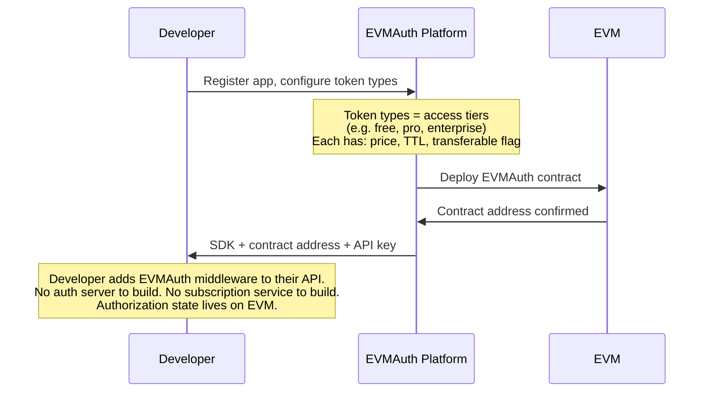
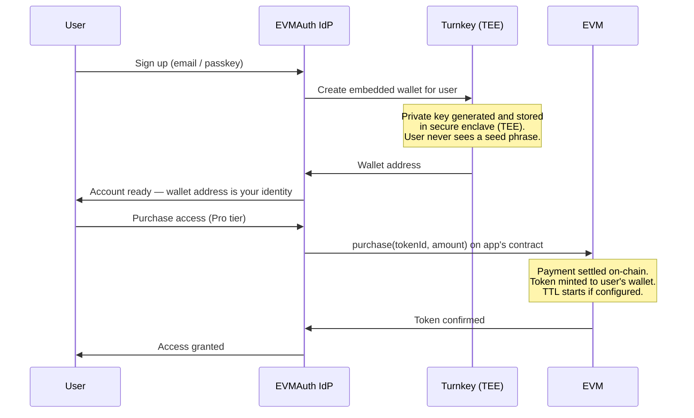
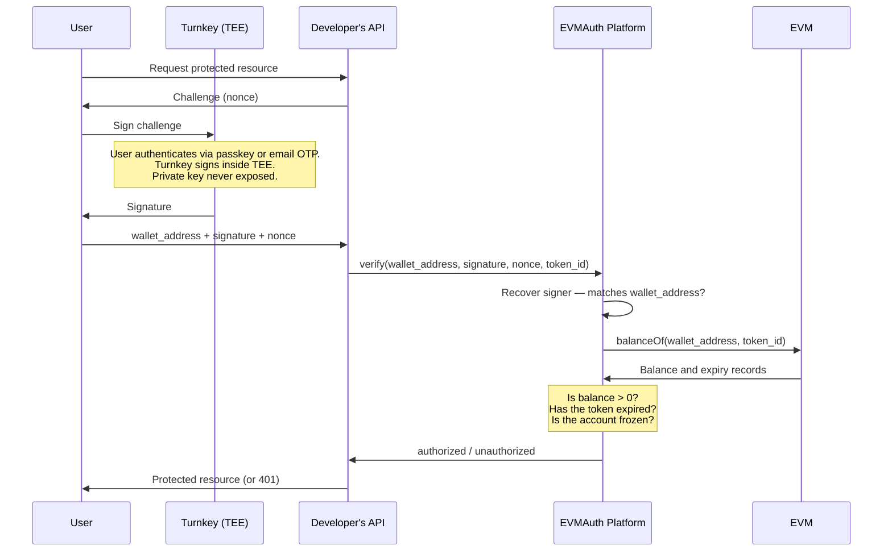

# EVMAuth: Authorization Without an Auth Server

EVMAuth is an authorization state management system for APIs, MCP servers, and AI agents. It replaces the constellation of services traditionally required to manage access — auth servers, subscription managers, billing integrations — with a single smart contract deployed to an EVM-compatible network.

This document explains what EVMAuth replaces, how it works, and where it fits into your application.

---

## The Problem with Traditional Authorization

A typical API that needs to authenticate users and gate access by subscription tier must operate and maintain:

- An **auth server** (OAuth 2.0 / OIDC) to issue and verify tokens
- A **user database** to store accounts, sessions, and identity
- A **subscription service** to track plan status and entitlements
- A **billing integration** (e.g. Stripe, PayPal) to process payments and sync subscription state back to the above
- Logic to **revoke access** when a subscription lapses or is cancelled

Each of these systems must be kept in sync. Authorization state — who has access to what — is split across multiple databases and services that your team builds, hosts, and operates.

EVMAuth consolidates authorization state into a single smart contract, which becomes the source of truth for access control. Your application no longer needs a separate auth server, subscription service, or billing-to-entitlement synchronization layer.

---

## Concepts: OAuth vs EVMAuth

If you are familiar with OAuth 2.0, OIDC, and PKCE, the EVMAuth model maps cleanly onto the same conceptual layers.

| Concept                    | OAuth / OIDC / PKCE                                     | EVMAuth                                                 |
|----------------------------|---------------------------------------------------------|---------------------------------------------------------|
| **Identity**               | OIDC ID Token (JWT from IdP)                            | Wallet address + cryptographic signature                |
| **Authorization state**    | Database rows, OAuth scopes                             | Token balances on EVM                                   |
| **Proof of identity**      | PKCE code verifier / client secret                      | Wallet signature (secp256k1)                            |
| **Subscription & billing** | Subscription service + payment provider + database      | Direct purchase or minting of EVMAuth tokens            |
| **Token expiry**           | JWT `exp` claim, managed by auth server                 | TTL configured per token type, enforced by the contract |
| **Revocation**             | Rotate refresh tokens, invalidate sessions              | Burn token or freeze wallet (instant, on-chain)         |
| **What you operate**       | Auth server + subscription service + billing + your app | EVMAuth contract + your app                             |

The three pillars of modern OAuth security map to EVMAuth equivalents:

- **OAuth 2.0** (the authorization framework) → **EVMAuth contract** — defines what a given wallet is permitted to access
- **PKCE** (cryptographic proof of identity) → **Wallet signature** — only the holder of the private key can produce a valid signature; no shared secret to leak
- **OIDC** (the identity layer) → **Turnkey embedded wallet** — gives every user a non-custodial wallet tied to a familiar login (passkey, email OTP), without exposing seed phrases

---

## Token Models

EVMAuth tokens are flexible. A single token type can be configured to represent two fundamentally different access models.

### Full access (binary)

A balance of one or more tokens of a given type grants access. The token may be non-expiring (a perpetual license) or configured with a TTL (a subscription). The API middleware checks: does this wallet hold a valid, unexpired token of the required type?

**Examples:** API key replacement, software license, subscription tier (Free / Pro / Enterprise).

### Metered usage (credits)

Tokens can be issued as credits and debited per unit of consumption. The API middleware checks the balance and deducts on each use. When the balance reaches zero, access is denied.

**Examples:** LLM inference credits, data API calls, per-request billing.

Both models — and any combination of them — are configured at the token type level on the EVMAuth contract. The same contract and middleware pattern supports both.

---

## Payment Options

Access tokens can reach a user's wallet through several paths, which can be combined:

**On-chain direct purchase.** If a token type is configured with a price, users can purchase tokens directly by calling the EVMAuth contract, paying with ETH, USDC, USDT, or any accepted ERC-20. Payment and minting happen atomically in a single transaction.

**Traditional payments (Stripe, PayPal, etc.).** The developer's API accepts payment through a standard payment provider, then programmatically mints EVMAuth tokens to the user's wallet using the EVMAuth SDK. This is the right path for apps with users who are not familiar with on-chain transactions, or where local regulation or UX requirements favor traditional checkout flows.

**x402.** Developers can use the [x402 payment protocol](https://x402.org) to accept micropayments over HTTP, then issue tokens accordingly — well-suited for metered, per-request models and AI agent workflows.

**Programmatic issuance.** Tokens can be minted to any wallet address at any time by an account holding the `MINTER_ROLE` on the contract. This covers free trials, promotional grants, internal tooling, or any workflow where access is granted outside a purchase flow.

---

## How It Works

### Step 1: Developer platform setup

The developer registers their application with the EVMAuth managed service platform, defines their token types (access tiers, pricing, TTL, transferability), and receives an SDK and contract address. No auth server is built or deployed.

### Step 2: User onboarding

The EVMAuth identity provider, backed by [Turnkey](https://turnkey.com) embedded wallet infrastructure, handles user signup and wallet provisioning. Users sign up with a passkey or email OTP — no seed phrases, no browser extensions.

Turnkey generates and stores the user's private key inside a Trusted Execution Environment (TEE). The key never leaves the secure enclave. From the user's perspective, they created an account. From the protocol's perspective, they now have a non-custodial wallet that is their on-chain identity.

Alternatively, the user purchases via a traditional checkout (Stripe, PayPal) or x402, and the developer's backend mints tokens to the user's wallet after payment is confirmed.

### Step 3: Runtime access

When a user requests a protected resource, the API issues a challenge (a nonce). The user's client requests a signature from Turnkey — the user authenticates with their passkey or email OTP, Turnkey signs inside the TEE, and the signature is returned. No private key is ever exposed to the client.

The API forwards the wallet address, signature, and nonce to the EVMAuth platform for verification, then queries the EVM contract for the user's token balance.

For metered usage, the API additionally calls `burn` (or the platform's deduct endpoint) to consume tokens from the user's balance after a successful request.

---

## Access Control and Revocation

The EVMAuth contract exposes role-based access control for operational management:

- **`MINTER_ROLE`** — issue tokens to any wallet (free trials, programmatic grants, post-payment issuance)
- **`BURNER_ROLE`** — deduct tokens from any wallet (metered usage, revocation)
- **`ACCESS_MANAGER_ROLE`** — freeze or unfreeze individual accounts, pause the contract
- **`TOKEN_MANAGER_ROLE`** — create and update token type configurations

Revocation is immediate. Freezing a wallet or burning its tokens takes effect at the next balance check — no cache invalidation, no session propagation delay, no waiting for a JWT to expire.

---

## Summary

EVMAuth replaces the authorization-specific parts of your infrastructure — the auth server, the subscription service, and the billing integration — with a smart contract and a middleware SDK. Authorization state is on-chain, verifiable, and interoperable with any EVM tooling.

Turnkey makes this practical for mainstream users by abstracting away wallets entirely. Users get a familiar signup flow. The protocol gets cryptographic identity. Neither side compromises.

For developers, the result is an authorization system that is simpler to integrate, cheaper to operate, and more capable by default — with subscription management, metered usage, multi-currency billing, instant revocation, and transferable licenses all available as per-token configuration options on a single contract.
